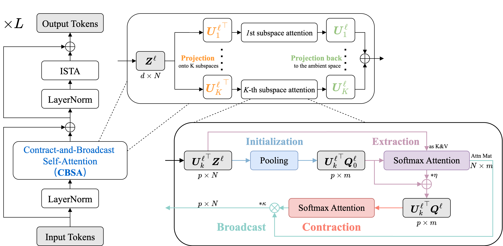

# Towards Interpretable and Efficient Attention: Compressing All by Contracting a Few

    <em>Contract-and-Broadcast Transformer (CBT) and Contract-and-Broadcast Self-Attention (CBSA).</em> 

## News
 More will be released in a few days — stay tuned!
 
🎉 Our paper has been accepted to NeurIPS 2025 as a Spotlight!

## Acknowledgements
The code for image classification and semantic segmention is mostly based on [CRATE](https://github.com/Ma-Lab-Berkeley/CRATE) and [Segmenter](https://github.com/rstrudel/segmenter), respectively.
