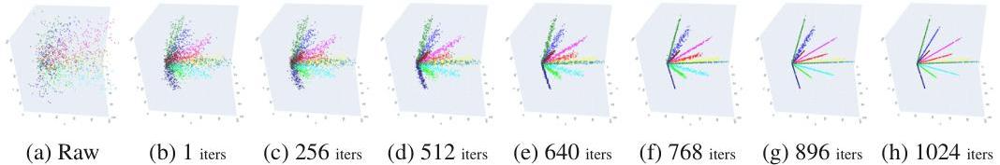

# CBSA (Contract-and-Broadcast Self-Attention) 

This repository is the official PyTorch implementation the paper:
+ **Towards Interpretable and Efficient Attention: Compressing All by Contracting a Few [[NeurIPS2025](https://neurips.cc/virtual/2025/poster/119786) | [arXiv](https://arxiv.org/abs/2509.16875) | [openreview](https://openreview.net/forum?id=6SI1pvb5xl)]**.

This paper extends our previous work that explored inherently interpretable Transformer decoders for semantic segmentation:
+ **Rethinking Decoders for Transformer-based Semantic Segmentation: A Compression Perspective [[NeurIPS2024](https://neurips.cc/virtual/2024/poster/95774) | [arXiv](https://arxiv.org/abs/2411.03033) | [github](https://github.com/QishuaiWen/DEPICT)｜[openreview](https://openreview.net/forum?id=IHjoPnNZb9)]**

Our CBSA is an inherently interpretable and efficient self-attention mechanism that offers the following advantages:
+ It is well-established on an optimization objective grounded in the principle of compression, where the forward pass of CBSA naturally arises from its optimization procedure.
+ It scales linearly with sequence length when the number of representatives is fixed.
+ It unifies a broad spectrum of attention mechanisms as special cases, reducing their fundamental differences to variations in the number and structure of representatives.
+ It demonstrates performance comparable to, or even surpassing, linear attention while maintaining nearly identical computational cost.
+ It shows emergent segmentation capabilities and robustness to parameter perturbations.

<p align="center">
    
<br> <em>Contract-and-Broadcast Self-Attention </em>
<p align="center">


<p align="center">
    
<br> <em> Illustration of our main idea. </em>
<p align="center">

## 📣 News
[2025/9/19] Our paper has been accepted to NeurIPS 2025 as a Spotlight🌟!

## 🔄 Updates
[2025/11/24] Our released [demo](https://www.kaggle.com/code/lupin11/cbsa-attention-map-visualization) for attention map visualization now supports ViTs from timm.

## 📊 Model Zoo

<div align="center">
  
  
  
  
  <br>
  <em>Performance comparison</em>
</div>

While the results above are obtained by finetuning ViTs pretrained on ImageNet-21K,
the CBT (Contract-and-Broadcast Transformer) models for image classification are built upon our CBSA and trained on the ImageNet-1K dataset with **naive data augmentation** preliminarily.

| Model      | Top-1 Acc | FLOPs  | #Params | Checkpoint |
|:------------:|----------------------:|--------:|--------:|:---------:|
| CBT-T     | 63.2%                | 1.1G   | 1.8M    | [link](https://drive.google.com/file/d/1GovOGBPDkHJDpOYX8KVJJeDrjwQvHfhb/view?usp=sharing) |
| CBT-S     | 71.4%                | 4.0G   | 6.7M    | [link](https://drive.google.com/file/d/1sKZBbIxvgPJmfO89TKaggKD0EdUJ7jSu/view?usp=sharing) |
| CBT-B     | 73.4%                | 15.1G  | 25.7M   | [link](https://drive.google.com/file/d/1CouOjiy3T9YRhYJFk4gL8PVOgiJ-bFgn/view?usp=sharing) |
| CBT-L     | 74.4%                | 47.3G  | 83.1M   | [link](https://drive.google.com/file/d/1xdEClU6xb5qSwxvDZROKfLac8mJ7R6vb/view?usp=sharing) |

The CBT decoders for semantic segmentation are stacked on the top of pretrained ViTs and trained on the ADE20K dataset.

| Model      | mIoU | FLOPs (decoder) | Checkpoint |
|:------------:|----------------------:|--------:|:---------:|
| CBT-T     | 39.1%                | 1.5G   | [link](https://drive.google.com/drive/folders/1Di7CKRsWA4k_WeNTQeiF6MbsWPCnPa6y?usp=sharing) |
| CBT-S     | 45.8%                | 2.3G   | [link](https://drive.google.com/drive/folders/1iFB5VugKRxRITexdGIhHzCYsntWOGWZj?usp=sharing) |
| CBT-B     | 49.3%                | 7.8G  | [link](https://drive.google.com/drive/folders/1pFmCFnSSSVs4J-ozB7YX-ZLlJUKDsdG0?usp=sharing) |
| CBT-L     | 53.3%                | 22.3G  | [link](https://drive.google.com/drive/folders/1FxrqFdskdclj70I3CNfpMrWxyewuog_I?usp=sharing) |

## 📝 Training and Inference

### Image Classification
To train a CBT model (e.g., CBT-Small) on ImageNet-1K, run the following command inside the `CBSA_image_classification` directory:

```python
python main.py
    --arch Ours_small
    --batch-size 256
    --epochs 150
    --optimizer Lion
    --lr 2e-4
    --weight-decay 0.05
    --print-freq 50
```

To evaluate a CBT model, run the following command inside the same directory (after downloading the checkpoints from the model zoo and placing them in the correct path):
```python
python main.py --arch Ours_small --evaluate --resume CKPT/CBT/cbt_small_best.pth.tar
```

### Semantic Segmentation

To train a CBT decoder with a ViT backbone for semantic segmentation, run the following command inside the `CBSA_semantic_segmentation` directory:

```python
python -m segm.train
    --log-dir log/CBT-Small
    --dataset ade20k
    --backbone vit_small_patch16_384
    --decoder mask_transformer
```

To evaluate them, run:

```python
python -m segm.eval.miou log/DEPICT-SA-Small/checkpoint.pth ade20k --singlescale
```

We provide a detailed guideline for this part in our previous [repository](https://github.com/QishuaiWen/DEPICT) on semantic segmentation.

### ViT Adaption

To adapt a ViT model pretrained on ImageNet-21K into the CBSA style, run the following command inside the `CBSA_finetune_vit` directory:

```python
python main.py
    --arch vit_small_patch16_224
    --batch-size 512 --epochs 50
    --optimizer AdamW
    --lr 5e-5
    --weight-decay 0.01
    --print-freq 50
```


## 🚀 Demos

+ Kaggle Notebook: [Visualize the Attention Maps](https://www.kaggle.com/code/lupin11/cbsa-attention-map-visualization)

<p align="center">
    
<br> <em> Attention map comparison </em>
<p align="center">

+ Kaggle Notebook: [Evaluate the Zero-Shot Segmentation Performance](https://www.kaggle.com/code/lupin11/attentionmapsegmentation)

+ Kaggle Notebook: [Experiment on synthetic data](https://www.kaggle.com/code/lupin11/synthetic-experiment)

<p align="center">
    
<br> <em> Compression of synthetic data </em>
<p align="center">

## Acknowledgement
Our code is largely built on [CRATE](https://github.com/Ma-Lab-Berkeley/CRATE) and [Segmenter](https://github.com/rstrudel/segmenter).
